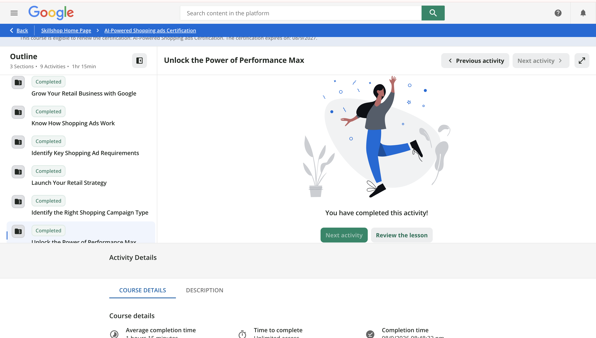

# Introduction

This report documents completion of the three Skillshop modules assigned for Part 2 of the Google Shopping Ads Certification (Launch Your Retail Strategy, Identify the Right Shopping Campaign Type, and Unlock the Power of Performance Max), and applies what I learned to the CPP Farm Store campaign plan[^1].

[^1]: This builds on the Part 1 certification and the [Google Merchant Center connection lab](https://daisyxhernandez20-oss.github.io/OACP-W06-GMC-Lab/) completed earlier in the term.

# Proof of Module Completion

The screenshot above confirms completion of all three assigned modules: Launch Your Retail Strategy, Identify the Right Shopping Campaign Type, and Unlock the Power of Performance Max.

# CPP Farm Store Application Reflection

For CPP Farm Store, the most appropriate retail campaign objective would be a blended online sales and store traffic goal rather than an online-sales-only objective. The Farm Store is fundamentally a physical, on-campus retail location with a real inventory of fresh, seasonal goods, so a campaign built purely to drive online checkout would undersell what actually makes the store distinctive: same-day fresh produce, plants, and local goods that customers can pick up in person. An objective that also credits store visits and local awareness reflects how a customer is likely to actually behave, discovering the store online, then visiting in person to make a purchase.

Product prioritization should lean on the same segmentation used throughout my practice storefront work this term. Fresh Produce and Dairy & Eggs are the highest-frequency, most habitual purchases and should anchor the campaign, since they are the products most likely to bring a customer back repeatedly. Garden & Plants and Pantry & Gifts are better suited to seasonal or occasion-based promotion, for example around graduation, move-in week, or holidays, rather than being promoted at the same constant cadence as the staple categories. Prioritizing a small number of high-frequency categories also keeps the product feed easier to manage and keep accurate, which matters given how quickly a farm store's actual inventory can change.

Given the Farm Store's mixed goals, a Performance Max campaign seems like the most appropriate approach rather than a narrower, single-channel Shopping campaign. Performance Max is built to pursue multiple objectives, including store visits, across Google's full set of channels (Search, Display, Maps, YouTube) from a single campaign, which matches a retailer whose customers move between browsing online and buying in person. A standard Shopping-only campaign would optimize narrowly for online purchases and would not naturally support the store-visit and local-discovery side of the Farm Store's business the way Performance Max can.

The campaign should support several customer touchpoints beyond just the product listing itself: Google Search for customers actively looking for local produce or a farm store nearby, Google Maps for customers deciding where to go in person, and Display or YouTube for building general awareness of the Farm Store among the broader CPP community who may not yet know it exists. Because the Farm Store's advantage is largely local and in-person, location-based signals and store visit tracking should be treated as core to the campaign, not an afterthought bolted onto an online-sales setup.

For KPIs, CPP Farm Store should track a mix of online and offline signals: return on ad spend and cost per conversion for the online side, but also estimated store visit conversions, click-through rate on location-relevant ad formats, and product-level impression and click data to see which categories are actually generating interest. These KPIs connect directly to our group's Campaign Plan and Dashboard deliverables, since the dashboard should be built to report both digital and estimated in-store outcomes rather than only checkout data, and the Campaign Plan's creative brief should be written with both a "search this online" and a "visit us today" call to action in mind, reflecting the omnichannel objective this reflection recommends.

# Appendix
 
- GitHub Repository: https://github.com/daisyxhernandez20-oss/OACP-GSA-Cert-Part2
- GitHub Pages Site: https://daisyxhernandez20-oss.github.io/OACP-GSA-Cert-Part2/
